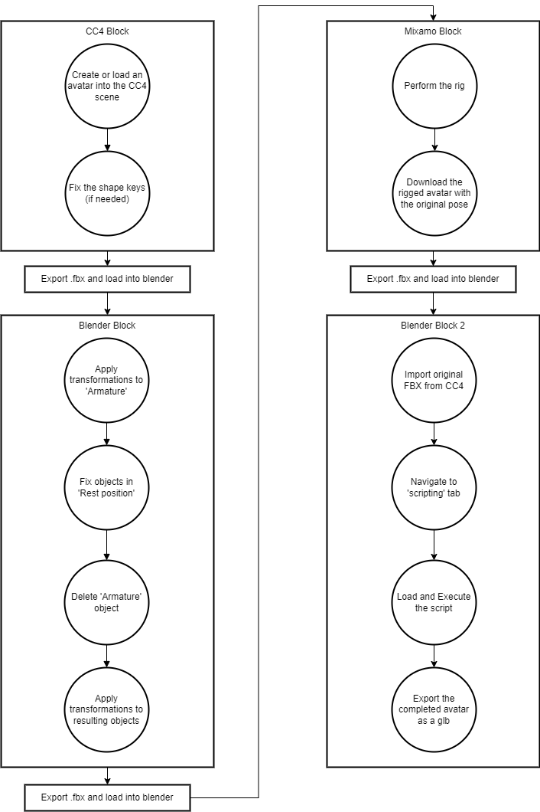

# Auto-Avatar-Fixer

AutoAvatarFixer is a Blender script that automatically fixes 3D avatars from Character Creator 4 that have been rigged with Mixamo.

The objective for this script is to standardize 3D avatars obtained from multiple sources. Our use case has been avatars from the software [Character Creator 4 (CC4)](https://www.reallusion.com/character-creator/) however it works for other sources too.

This is why there are two different scripts:
1. **CC4_script.py** - Intended for CC4 avatars.
2. **General_script.py** - A more general script that needs to be manually filled with additional information at the beginning of the script.

For the general script The idea is to load an avatar after applying the [Mixamo](https://www.mixamo.com/) rigging and run the script.

The CC4_script needs the Mixamo rigged avatar loaded first in the blender scene and after the original avatar that was exported from CC4 as it uses the original hands rig for the final version.

Here's an outline of all the process that this script does:

## Script Explanation

This script is divided into various steps,

1. **Fix and Merge Armature:**
   - Applies transforms to all objects in the scene and sets all objects to visible.
   - Transfers shape keys from one armature to another, and removes meshes from armature_CC4.

2. **Armature Cleanup:**
   - Delete hands bones on the mixamo armature.
   - Delete all bones but the hand ones on the cc4 armature.

3. **Skeleton Join:**
   - Joins two armatures, armature_CC4 and armature_mixamo, and parents hands bones.

4. **Add Fingers & Rename:**
   - Renames specific bones.
   - Modifies the armature and creates additional bones for fingers (end sites).

5. **Correct Materials:**
   - Updates materials to ensure they have the correct textures, shaders, and naming.

6. **Rigging:**
   - Copies the body mesh, merges its vertices, and applies automatic rigging to it.
   - Transfers weights between the copied body and other objects (clothing).
   - Merges vertices of all objects.

7. **Reduce Blendshapes:**
   - Removes shape keys (blendshapes) from objects, except for face-related shape keys.
   - Separates parts of the mesh based on materials and renames the objects.

8. **Eye Bones & Rename Armature:**
   - Renames bones in the armature and creates eye bones.
   - Assigns vertex groups for the eyes and positions the eye bones.

9. **Fix Skeleton Position:**
   - Aligns the arms positions to point at the desired vector (1,0,0).

## Explanation and Workflow

Finally, as this is a script to help obtain a well-configurated avatar for our applications, here's an example pipeline to be followed from obtaining an avatar to fixing it:

We rely on the software Character Creator 4 to generate a good quality avatar but you can use avatar from other sources using the general script. Here are the steps to follow:

1. **Generate Avatar in Character Creator 4:**
   - Create a high-quality avatar in Character Creator 4.
   - Export the avatar as a `.fbx` file.

2. **Prepare Avatar in Blender:**
   - Load the `.fbx` file into Blender.
   - Delete the armature and any useless information.
   - Ensure that the blendshapes are preserved.
   - Export the model again as a `.fbx` file.
   - Leave the Blender project open for later use.

3. **Auto-Rigging in Mixamo:**
   - Import the `.fbx` file into the Mixamo website.
   - Perform the Auto-Rigging process.
   - Download the rigged character from Mixamo.

4. **Run AutoAvatarFixer Script:**
   - Load the rigged character back into Blender.
   - Run the appropriate script (`CC4_script.py` or `General_script.py`) to fix the avatar.

Here's a diagram of the process:

  
   
  
Visual diagram of the pipeline using the CC4 script to obtain new corrected 3D models.

